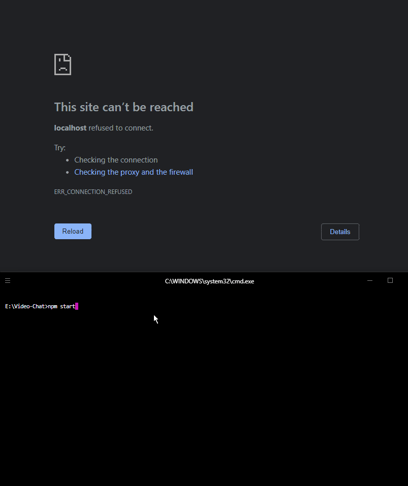

# Video-Chat

A Video Chat Application made using WebRTC - run with:

> npm start

And open webpage on `http://localhost:8888`:




<!-- TOC -->

- [WebRTC Protocols](#webrtc-protocols)
    - [Session Description Protocol (SDP)](#session-description-protocol-sdp)
    - [Interactive Connectivity Establishment (ICE)](#interactive-connectivity-establishment-ice)
    - [Real-time Transport Protocol (RTP)](#real-time-transport-protocol-rtp)
    - [Stream Control Transmission Protocol (SCTP)](#stream-control-transmission-protocol-sctp)

<!-- /TOC -->


## WebRTC Protocols

<!-- https://webrtc.github.io/samples/src/content/peerconnection/munge-sdp/ -->

### Session Description Protocol (SDP)

The [Session Description Protocol (SDP)](https://en.wikipedia.org/wiki/Session_Description_Protocol) is a format for describing multimedia communication sessions for the purposes of session announcement and session invitation. Its predominant use is in support of streaming media applications, such as voice over IP (VoIP) and video conferencing. SDP does not deliver any media streams itself but is used between endpoints for negotiation of network metrics, media types, and other associated properties. The set of properties and parameters is called a session profile.

The Session Description Protocol describes a session as a group of fields in a text-based format, one field per line.[note 1] The form of each field is as follows.


```bash
<character>=<value><CR><LF>
```


Optional values are specified with =* and each field must appear in the order shown below.


| Session description | |
| -- | -- |
| v =  | (protocol version number, currently only 0) |
| o =  | (originator and session identifier : username, id, version number, network address) |
| s =  | (session name : mandatory with at least one UTF-8-encoded character) |
| i =* | (session title or short information) |
| u =* | (URI of description) |
| e =* | (zero or more email address with optional name of contacts) |
| p =* | (zero or more phone number with optional name of contacts) |
| c =* | (connection information—not required if included in all media) |
| b =* | (zero or more bandwidth information lines) |
| z=* | (time zone adjustments) |
| k=* | (encryption key) |
| a=* | (zero or more session attribute lines) |


| Time description (mandatory) | |
| -- | -- |
| t=  | (time the session is active) |
| r=* | (zero or more repeat times) |


| Media description (optional) | |
| -- | -- |
| m=  | (media name and transport address) |
| i=* | (media title or information field) |
| c=* | (connection information — optional if included at session level) |
| b=* | (zero or more bandwidth information lines) |
| k=* | (encryption key) |
| a=* | (zero or more media attribute lines — overriding the Session attribute lines) |


> This example session is originated by the user "jdoe", at IPv4 address 10.47.16.5. Its name is "SDP Seminar" and extended session information ("A Seminar on the session description protocol") is included along with a link for additional information and an email address to contact the responsible party, Jane Doe. This session is specified to last for two hours using NTP timestamps, with a connection address (which indicates the address clients must connect to or — when a multicast address is provided, as it is here — subscribe to) specified as IPv4 224.2.17.12 with a TTL of 127. Recipients of this session description are instructed to only receive media. Two media descriptions are provided, both using RTP Audio Video Profile. The first is an audio stream on port 49170 using RTP/AVP payload type 0 (defined by RFC 3551 as PCMU), and the second is a video stream on port 51372 using RTP/AVP payload type 99 (defined as "dynamic"). Finally, an attribute is included which maps RTP/AVP payload type 99 to format h263-1998 with a 90kHz clock rate. RTCP ports for the audio and video streams of 49171 and 51373, respectively, are implied.


```conf
    v=0
    o=jdoe 2890844526 2890842807 IN IP4 10.47.16.5
    s=SDP Seminar
    i=A Seminar on the session description protocol
    u=http://www.example.com/seminars/sdp.pdf
    e=j.doe@example.com (Jane Doe)
    c=IN IP4 224.2.17.12/127
    t=2873397496 2873404696
    a=recvonly
    m=audio 49170 RTP/AVP 0
    m=video 51372 RTP/AVP 99
    a=rtpmap:99 h263-1998/90000
```


### Interactive Connectivity Establishment (ICE)

[Interactive Connectivity Establishment (ICE)](https://en.wikipedia.org/wiki/Interactive_Connectivity_Establishment) is a technique used in computer networking to find ways for two computers to talk to each other as directly as possible in peer-to-peer networking. This is most commonly used for interactive media such as Voice over Internet Protocol (VoIP), peer-to-peer communications, video, and instant messaging.


ICE provides a framework with which a communicating peer may discover and communicate its public IP address so that it can be reached by other peers. Session Traversal Utilities for NAT (__STUN__) is a standardized protocol for such address discovery including NAT classification. Traversal Using Relays around NAT (__TURN__) places a third-party server to relay messages between two clients when direct media traffic between peers is not allowed by a firewall.


### Real-time Transport Protocol (RTP)

[The Real-time Transport Protocol (RTP)](https://en.wikipedia.org/wiki/Real-time_Transport_Protocol) is a network protocol for delivering audio and video over IP networks. RTP is used in communication and entertainment systems that involve streaming media, such as telephony, video teleconference applications including WebRTC, television services and web-based push-to-talk features.


RTP is used in conjunction with the __Real-time Control Protocol (RTCP)__. While RTP carries the media streams (e.g., audio and video), RTCP is used to monitor transmission statistics and quality of service (QoS) and aids synchronization of multiple streams.


### Stream Control Transmission Protocol (SCTP)

The [Stream Control Transmission Protocol (SCTP)](https://en.wikipedia.org/wiki/Stream_Control_Transmission_Protocol) is a computer networking communications protocol that is used in webRTC to transport all non-media information (that are already covered by RTP).


SCTP applications submit data for transmission in messages (groups of bytes) to the SCTP transport layer. SCTP places messages and control information into separate chunks (data chunks and control chunks), each identified by a chunk header. The protocol can fragment a message into multiple data chunks, but each data chunk contains data from only one user message. SCTP bundles the chunks into SCTP packets. The SCTP packet, which is submitted to the Internet Protocol, consists of a packet header, SCTP control chunks (when necessary), followed by SCTP data chunks (when available).


---

++++++++++++++++++++++++++++++++++++++++++++++++

++++++++++++++++ ORIGINAL README +++++++++++++++++++

++++++++++++++++++++++++++++++++++++++++++++++++


# Video-Chat
A Video Chat Application made using WebRTC

This is a video chat application made as part of my Udemy Course, [Practical WebRTC: A Complete WebRTC Bootcamp for Beginners](https://www.udemy.com/course/practical-webrtc-a-complete-webrtc-bootcamp-for-beginners/)

The front end is pure HTML,CSS,Javascript. 
The Backend is in Node.js.

Steps to run

1. Clone the repository
2. Dependencies are all pushed along with the code so you don't need `npm install`
3. Run `node index.js`

There is a second branch to this repository that contains the upgraded version of this video chat application with added buttons like mute, hide camera and leave room.
